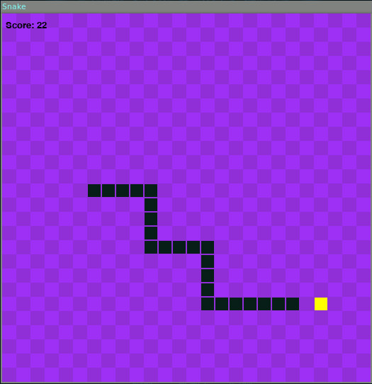

# Snake
The classic snake game implemented in Python using the [pygame](https://pygame.org) module.

***

## Prerequisite
The game depends on the [pygame](https:/pygame.org) module so it needs to be installed first.  
```
$ pip install pygame
```

***

## Running the program
```
$ python snake.py
```

***

## Game Screenshot
